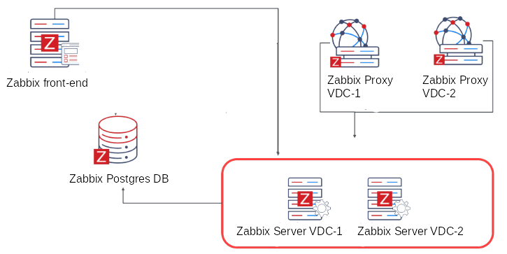
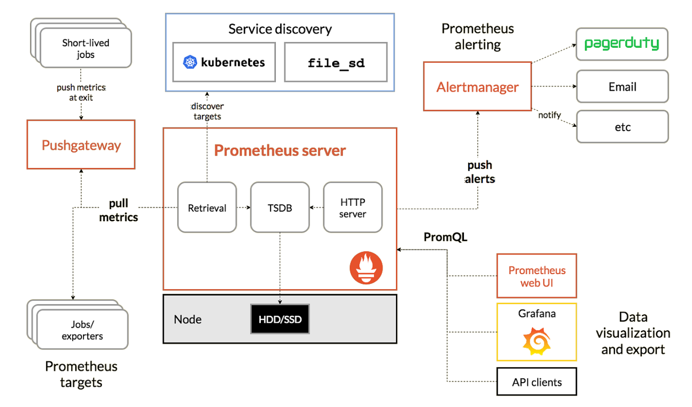
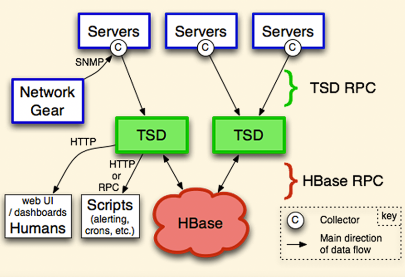
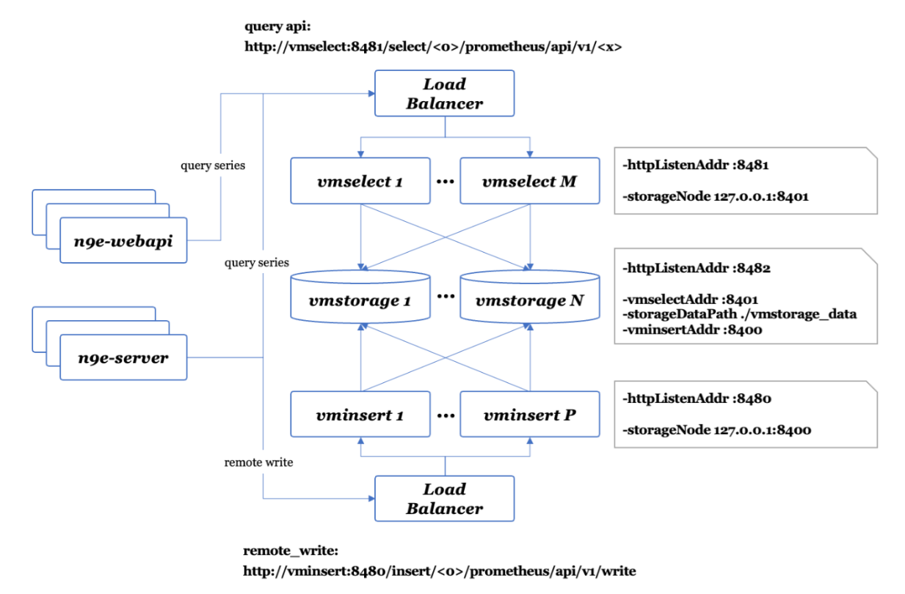

> 当前应用系统架构复杂，涵盖服务、网络、数据库、中间件等各个方面，涉及各种组件框架，要想确保应用服务稳定、高效的运行，必须对上述方面进行全方位的监控。

## 一、监控要关注的问题

- 指标类型、关键指标
- 高可用监控系统构建与存储选型
- 如何监控数据库、中间件如 MySQL、Redis、Kafka、ElasticSearch 等
- 如何监控 Kubernetes 
- 如何设置埋点、如何分析日志等
- 如何实现告警规则、屏蔽规则、抑制规则、订阅规则的管理
- 如何做到告警自愈、告警聚合收敛以及事件闭环

## 二、监控要覆盖的需求

核心：监控系统状态、及时感知问题。

- 通过监控了解数据趋势，知道系统在未来的某个时刻可能出问题，预知问题。
- 通过监控了解系统的水位情况，为 服务扩缩容提供数据支撑。 
- 通过监控来给系统把脉，感知到哪里需要优化，比如一些中间件参数的调优。 
- 通过监控来洞察业务，提供业务决策的数据依据，及时感知业务异常。

## 三、故障的生命周期

开始、发现、定位、止损、恢复、复盘

## 四、可观测性三大支柱

### 4.1 指标监控

指标监控领域的开源产品有 Zabbix、Prometheus

- 基础设施监控：服务器、虚拟机、网络设备等基础设施组件的性能数据，包括 CPU 使用率、内存占用、网络流量等。
- 应用程序监控： 性能指标，如响应时间、请求成功率、错误率等应用程序的性能指标。

### 4.2 日志

开源产品 ELK（ Elasticsearch、Logstash 和 Kibana ） 和 Loki，商业产品 Splunk 和 Datadog

- 操作系统日志：系统事件观测
- 接入层日志：域名、IP、URL 等访问率、成功率以及延迟等情况
- 服务运行日志：异常信息、调用堆栈等

### 4.3 分布式链路追踪（Tracing）

链路追踪产品：Skywalking、Jaeger、Zipkin 等

其思路是以请求串联上下游模块，实现追踪调用链路，监控链路性能，排查链路故障。

其基本原理就是在分布式应用的接口方法上设置一些观察点（类似快递中转站记录点），然后在入口节点给每个请求分配一个全局唯一的标识 TraceId（类似快递单号），当请求流经这些观察点时就会记录一行对应的链路日志（包含链路唯一标识，接口名称，时间戳，主机信息等）。最后通过 TraceId 将一次请求的所有链路日志进行组装，就可以还原出该次请求的链路轨迹

一个完整请求链路包含以下内容：

- 追踪ID（traceid）用于查出本次请求调用的所有服务，每一次服务调用的跨度ID（spanid）用来记录调用顺序
- 上游服务parenetid用来记录调用的层级关系
- 调用时间timestamp，把请求发出、接收、处理的时间都记录下来，计算业务处理耗时和网络耗时，然后用可视化界面展示出来每个调用链路，性能，故障
- 还可以记录一些其他信息，比如发起调用服务名称、被调服务名称、返回结果、IP、调用服务的名称等。
- 最后，我们再把相同spanid的信息合成一个大的span块，就完成了一个完整的调用链。

## 五 解决方案

### 5.1 zabbix

是一个企业级的开源分布式监控解决方案，由以下几个主要的软件组件组成：

- Zabbix server 是 agents 向其报告可用性和完整性信息和统计信息的中心组件。server 是存储所有配置、统计和操作数据的中央存储库。

- 数据存储
  Zabbix 收集的所有配置信息以及数据都存储在数据库中。

- Web 界面
  为了从任何地方和任何平台轻松访问，Zabbix 提供了基于 Web 的界面。该接口是 Zabbix server 的一部分，通常（但不一定）与 server 运行在同一台设备上。

- Proxy
  Zabbix proxy 可以代替 Zabbix server 收集性能和可用性数据。proxy 是 Zabbix 部署的可选部分；但是对于分散单个 Zabbix server 的负载非常有用。

- Agent
  Zabbix agent 部署在被监控目标上，以主动监控本地资源和应用程序，并将收集到的数据报告给 Zabbix server。

优势：

- 对各种设备的兼容性较好，Agentd 不但可以在 Windows、Linux 上运行，也可以在 Aix 上运行。
- 架构简单，使用数据库做时序数据存储，易于维护，备份和转储都比较容易。
- 社区庞大、资料丰富、尤其官方文档很详细

缺点：

- 使用数据库做存储，无法水平扩展
- 面向资产的管理逻辑，监控指标的数据结构较为固化，没有灵活的标签设计，面对云原生架构下动态多变的环境

### 5.2 Prometheus

- Prometheus 概述

Prometheus是一个开源的系统监控和报警系统，它于 2012 年由 SoundCloud 开源，是继 Kubernetes 之后第二个在云原生计算基金会托管的项目。作为基于时序数据库的开源监控告警系统，非常适合Kubernetes集群的监控，输出被监控组件信息的HTTP接口被叫做Exporter。Exporter的实例称为一个Target。Prometheus通过轮询的方式定时从这些Target中获取监控数据样本，并存储在数据库当中，目前互联网公司常用的组件大部分都有成熟的Exporter可以直接使用，例如：kube-state-metrics、blackbox_exporter 以及node_exporter等。此外，还支持pushgateway进行数据上报，Prometheus性能足够支撑上万台规模的集群

- Prometheus 的优点 

对 Kubernetes 支持得很好，目前来看，Prometheus 就是 Kubernetes 监控的标配。 生态庞大，有各种各样的 Exporter，支持各种各样的时序库作为后端的 Backend 存储，也有很好的支持多种不同语言的 SDK，供业务代码嵌入埋点。 

- Prometheus 的缺点 

易用性差一些，比如告警策略需要修改配置文件，协同起来比较麻烦。当然了，对于 IaC 落地较好的公司，反而认为这样更好，不过在国内当下的环境来看，还无法走得这么靠前，大家还是更喜欢用 Web 界面来查看监控数据、管理告警规则。 Exporter 参差不齐，通常是一个监控目标一个 Exporter，管理起来成本比较高。 容量问题，Prometheus 默认只提供单机时序库，集群方案需要依赖其他的时序库。

## 六、常见概念

### 6.1 监控指标

| 指标标识           | 优点                 | 缺点                                   |
| ------------------ | -------------------- | -------------------------------------- |
| 全局唯一标识字符串 | 简单                 | 缺少维度信息不便于做聚合计算和灵活筛选 |
| 标签集的组合       | 灵活                 | 存在冗余                               |
| 优雅高效的influx   | 灵活、精巧、语义丰富 | 理解成本稍高                           |

### 6.2 指标类型

Prometheus 生态也支持数据类型，分为 Gauge、Counter、Histogram、Summary 4 种

- Counter
  计数类型，数据是单调递增的指标，服务重启之后会重置。可以用 Counter 来监控请求数/异常数/用户登录数/订单数等。

- Gauge
  当前值，监控打点的时候可对其做加减。可以用 Gauge 来监控当前内存使用率 /CPU 使用率/当前线程数/队列个数等。

- Histogram

  直方图类型，用于描述数据分布，最典型的应用场景就是监控延迟数据，计算 90 分位、99 分位的值。Prometheus 会根据配置的 Bucket 来计算样本的分布情况，后期可以再加工，一般多用于耗时的监控，通过 Histogram 可以计算出 P99/P95/P50等耗时，同时也可以监控处理的个数，如果用上 Histogram 就不需要再用 Counter 统计个数。可以用 Histogram 来监控接口响应时间/数据库访问耗时等。

- Summary
  和 Histogram 有一点类似，也是计算样本的分布情况，区别是 Summary 会在客户端计算出分布情况(P99/P95/Sum/Count)，因此也会更占客户端资源，后期不可再聚合计算处理，同样可以用 Summary 来监控接口响应时间/数据库访问耗时等。

为什么还需要划分这么多类型呢？最主要的作用是在采集侧埋点的时候，SDK 会根据数据类型做不同的计算逻辑，比如 Histogram 类型，每次请求进来的时候，代码里调用一下 SDK 的 Observe 方法通知 SDK，SDK 就会自动计算生成多个指标，提升埋点便利性。

### 6.3 时序库

时序数据库 (TSDB) 是一种数据库管理系统，用于存储、处理和分析时间序列数据（以下简称时序数据）。

那什么是时序数据呢？

1. **时间戳：**时序数据最大的特点是每一条数据都带有时间戳，通常是单调顺序，不会乱序，流式发给服务端，通常不会修改，比如指标数据和日志数据，都是典型的时序数据，这个时间戳对于数据的计算和分析十分重要。
2. **结构化：**与来自网络爬虫、微博、微信的海量数据不同，监控系统生成的数据都是结构化的。这些数据都具有预定义的数据类型或固定长度。
3. **流式：**数据源以近似恒定速率生成数据，如音频或视频流。这些数据流彼此独立。
4. **流量平稳可预测：**与电商平台或社交媒体网站的数据不同，时序数据的流量在一段时间内是稳定的，并且可以根据数据源的数量和采样周期来进行计算和预测。
5. **不变性：**时序数据一般都是 append-only，类似于日志数据，一般不容许而且也没有修改的必要。很少有场景，需要对采集的原始数据进行修改。

Prometheus 其实也内置实现了一个时序存储模块。

### 6.4 告警收敛与闭环

1. 告警收敛

   目的：避免形成告警风暴

   方法：

   - 告警聚合发送，聚合可以采用不同的维度，比如时间维度、策略维度、监控对象维度等
   - 将多个事件聚合成告警，再把多个告警聚合成故障

2. 告警闭环

   告警认领、告警流转、告警升级等机制确认告警闭环处理

## 七、监控典型架构

1. 采集器负责采集数据，并推送至时序库存储

   - 直推至时序库

   - 推送至Kafka，再经由Kafka写入时序库

   - 常见采集器

     | 采集器        | 优点                         | 缺点                                 | 推荐场景                                |
     | ------------- | ---------------------------- | ------------------------------------ | --------------------------------------- |
     | Telegraf      | 指标方面的全家桶             | 对 Prometheus 生态适配一般           | 与 InfulxDB 一起部署，作为统一Agent使用 |
     | Exporters     | 生态庞大，涵盖大部分监控场景 | 各个Exporter 水平参差不齐            | Kubernetes 生态                         |
     | Grafana-Agent | 指标、日志、链路的全方位采集 | 集成的采集器不全，采集多个目标不方便 | Kubernetes 生态                         |

2. 时序库负责存储时序数据

   - OpenTSDB

     

   - VictoriaMetrics

     不仅能作为时序数据库结合 Prometheus 使用进行指标的长期远程存储，也能单独作为一个监控解决方案对 Prometheus 进行平替

     

3. 告警引擎从时序库等读取数据做规则判断

   

4. 告警发送模块负责发送告警时间

5. 数据展示模块从时序库读取数据根据配置的规则、语句以及模板等进行渲染展示

- 
